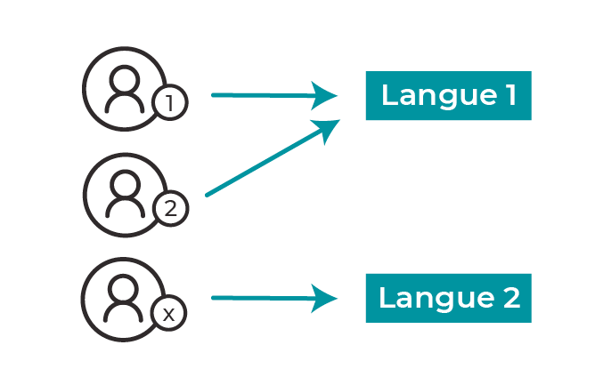
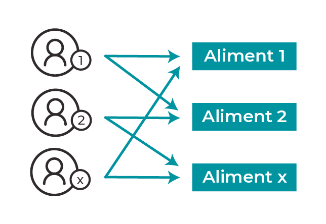
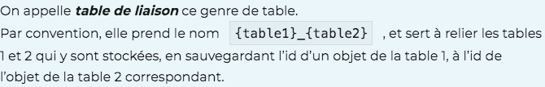
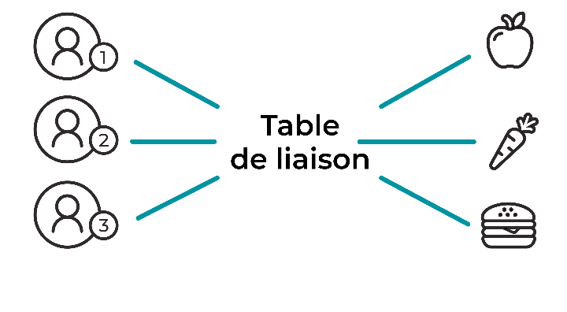
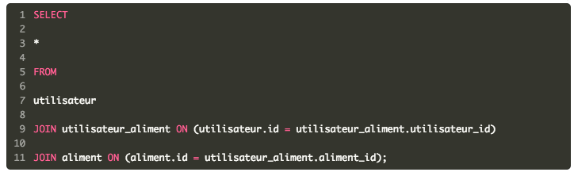

MY_SQLCOURSES
==============
OPEN CLASSROOM
--------------

###Implémentez des relations entre vos données grâce à JOIN
>Extrayez des informations via une relation 1 à plusieurs **one-to-many**
> 
> 

>Obtenez des informations complexes via une relation plusieurs à plusieurs **many to many**
> 
> 
> 
> 
>

Voici les explications de cette commande :

- On modifie toujours la structure d’une table avecALTER TABLE.
- On lui signale à nouveau quelle table modifier (ici, “aliment”).
- On lui indique que la modification va modifier le nom d’une colonne avecCHANGE.
- On mentionne le nom de la colonne à renommer, ainsi que son nouveau nom (ici, “sucre” devient “sucres”).
- On indique le nouveau type de la colonne (ici,FLOAT).
- Vous savez que toute modification de la structure d’un objet s’effectue avec une commandeALTER TABLE.
- Pour ajouter un champ à un objet, il vous faut utiliser le mot cléADD.
- Pour supprimer un champ, le mot clé estDROP.
- Pour modifier un champ, le mot clé estMODIFYpour en modifier la structure,CHANGEpour le renommer.


#### BACK UP CODE
render article foreach loop
```injectablephp
<?php

    function renderArticle()
    {

       return <?php foreach ($postsTab as $post): ?>
        <fieldset class="post">
            <form name="modifyPost" id="modifyPost" method="post" action="index.php" class="form">
                <aside>
                    getUserID()-1]->getAvatarURL()?>" alt="avatar of <?= $usersTab[$post->getUserID()-1]->getUserName()?>">
                </aside>
                <article>
                    <?="poste id ".$post_id = $post->getId();?>
                    <h2><?= $usersTab[$post->getUserID()-1]->getUserName()?></h2>
                    <textarea form="modifyPost" name="text_modify" autocapitalize="sentences"  rows="3" cols="35"><?= $post->getContent() ?></textarea>
                    <button type="submit">modify</button>
                    <button type="reset">delete</button>
                    <strong>Date : <?= $post->getPostDate() ?></strong>
                </article>
            </form>
        </fieldset>
        <?php endforeach; ?>
        }

```

